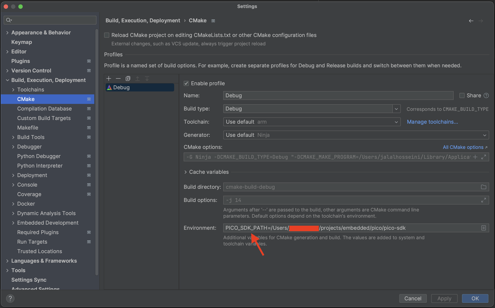
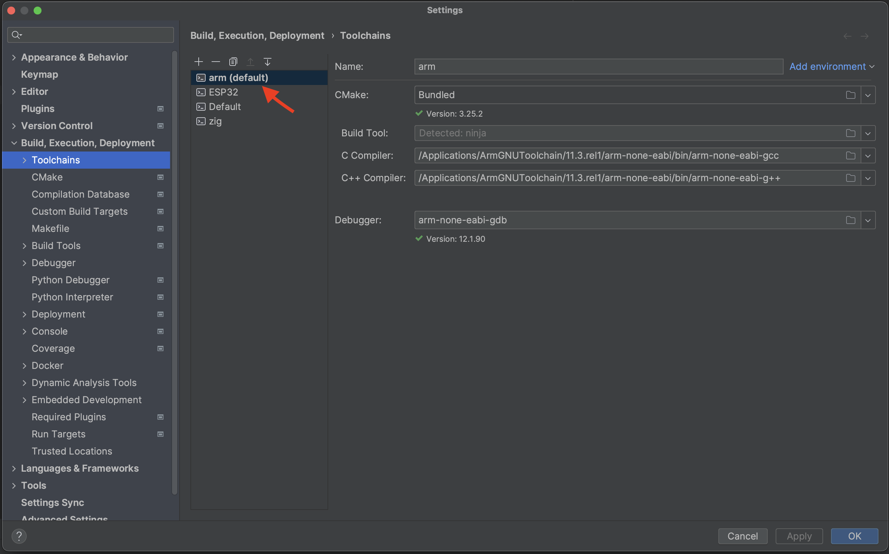
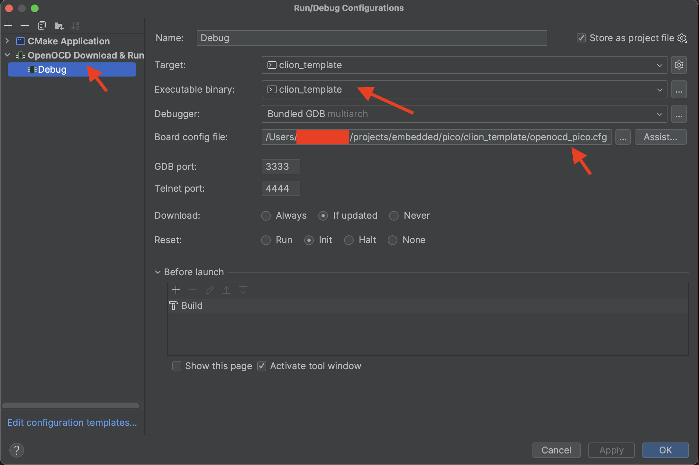
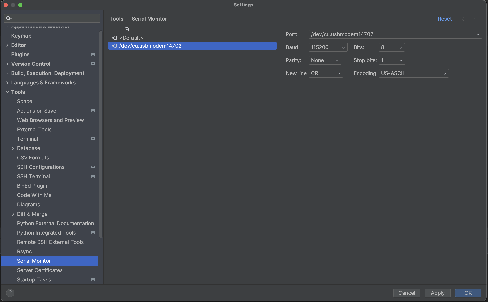
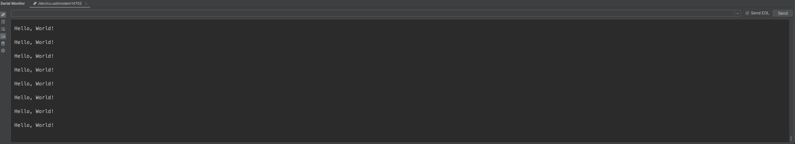

### CLion Raspberry Pi pico template project

Project template for pico board. It uses picoprobe and openocd for debugging.

### Getting started
Follow [pico getting started guide](https://datasheets.raspberrypi.com/pico/getting-started-with-pico.pdf). Appendix A of this 
pdf contains instructions and wiring to get started with picoprobe.

Open this project using CLion. Add an `PICO_SDK_PATH=<path-to-sdk>` to your cmake profile:

At this point CLion won't be able to build your project. You need to configure your arm cross-compiler toolchain:

Your CLion project is now ready for use. You can build the project and upload the generated file. If you followed the 
picoprobe guide you can start debugging but, first you need to create an openocd config:

OpenOCD plugin, only accepts one single file. This means we can't add separate files for `board` and `interface` like what you see in the pico documentation.
The solution to this is to create a custom file and then source all required files. `openocd_pico.cfg` file serves as our config.

To get serial console, you need to first install "Serial Monitor" plugin and then create a new connection:

output:

### Caveats
I commented out usb stdio because, enabling it was causing weird debug behaviour. 